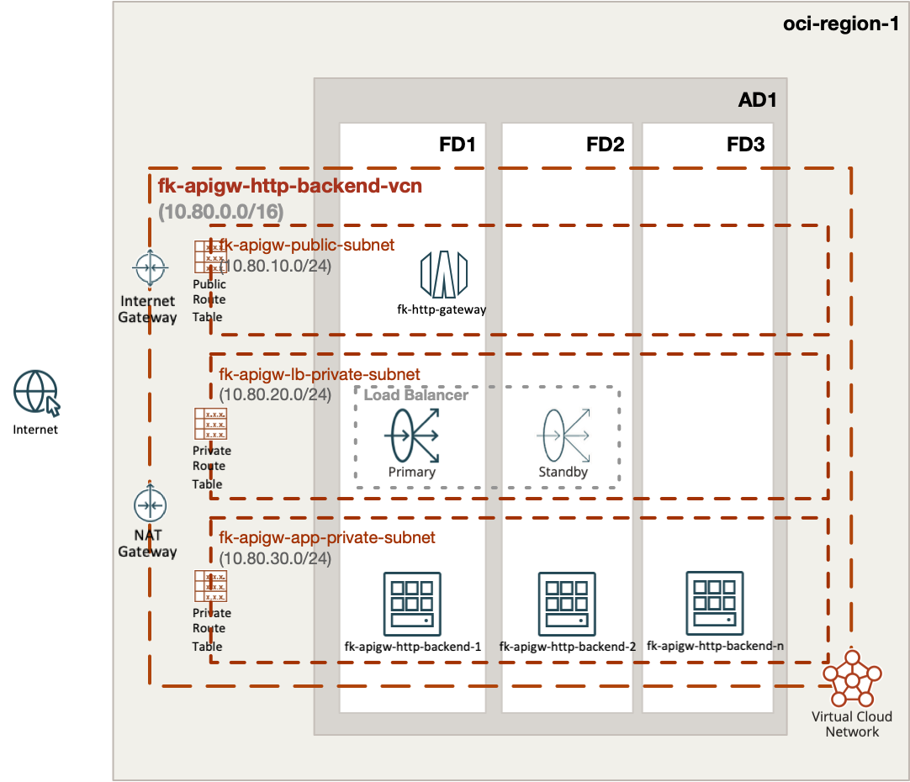
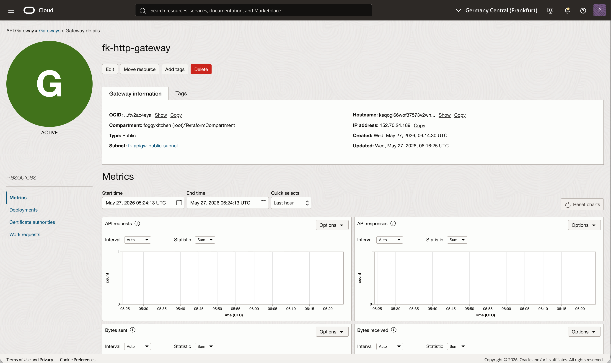
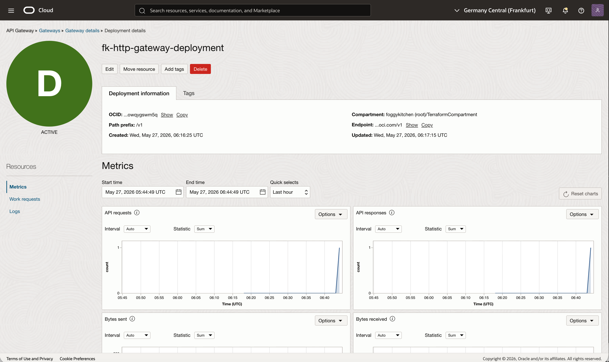
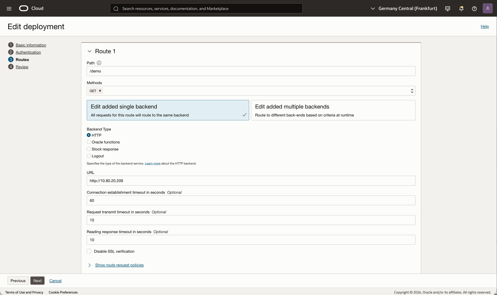
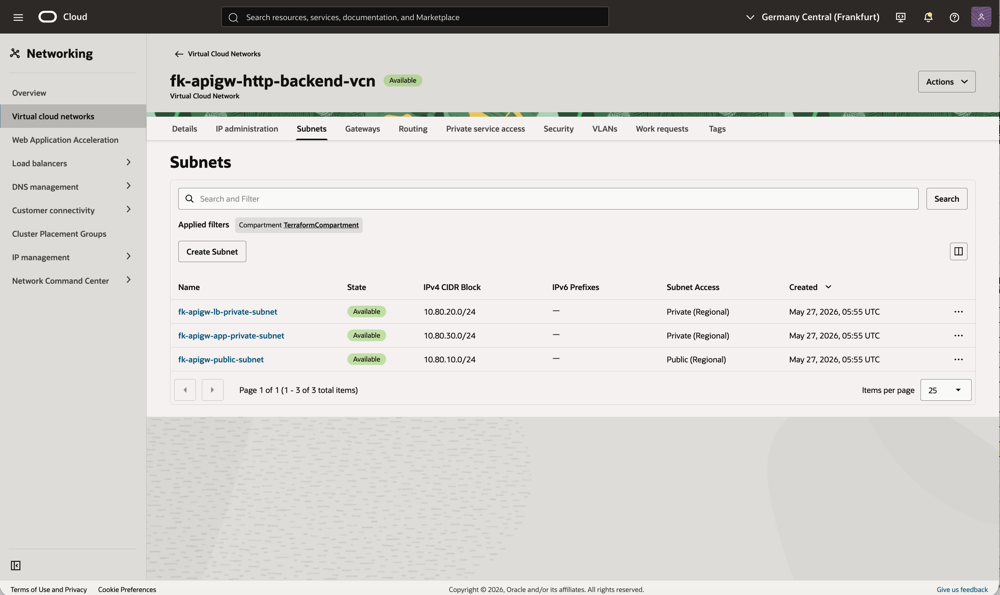
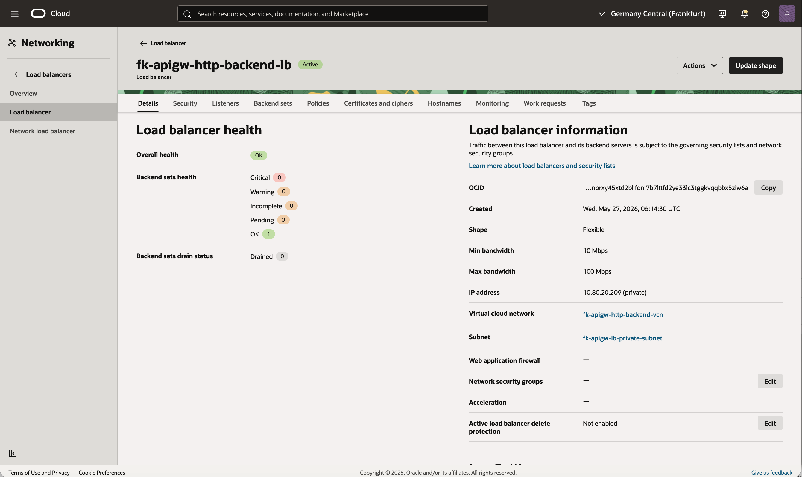
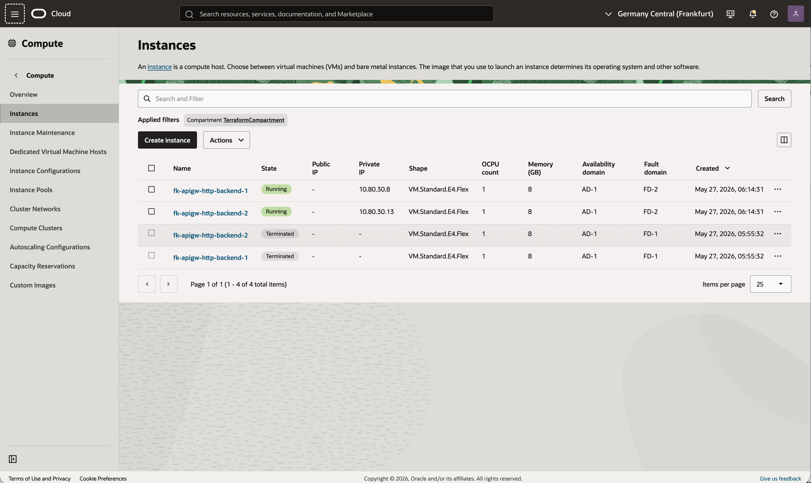

# Example 01: HTTP Backend Through Load Balancer And Compute

This example shows a complete **OCI API Gateway -> private OCI Load Balancer -> OCI Compute** flow built from reusable FoggyKitchen modules.

The stack creates:
- `terraform-oci-fk-vcn` for networking
- `terraform-oci-fk-compute` for two private backend instances
- `terraform-oci-fk-loadbalancer` for the private HTTP backend endpoint
- `terraform-oci-fk-api-gateway` for the public API publishing layer

This makes the example fully self-contained and avoids relying on an external `backend_url`.

---

## Architecture Overview


Figure 1. High-level architecture for the example.
Traffic enters through a public OCI API Gateway, is forwarded to a private OCI Load Balancer, and then reaches private compute backends in the application subnet.

The diagram is conceptual. The default deployment uses `instance_count = 2`, but the backend layer can be scaled to more instances if needed.

---

## What This Example Shows

- Public OCI API Gateway endpoint
- Private OCI Load Balancer used as an HTTP backend target
- Two private compute instances behind the load balancer
- Shared cloud-init bootstrap that starts a simple demo HTTP service
- End-to-end reusable module composition across networking, compute, load balancing, and API publishing

---

## Deploy Using Terraform CLI

```bash
cd examples/01_public_http_backend
cp terraform.tfvars.example terraform.tfvars
tofu init
tofu plan
tofu apply
```

After apply, the example outputs:
- API Gateway deployment endpoint
- resolved route endpoint for `/v1/demo`
- load balancer private IPs
- backend compute private IPs

---

## Validate The Deployment

Invoke the API Gateway route:

```bash
curl -s "$(tofu output -raw gateway_endpoint)/demo"
```

For a more explicit smoke test with headers:

```bash
ROUTE="$(tofu output -raw gateway_endpoint)/demo"
curl -sS -D - "$ROUTE"
```

The HTML response should contain the backend hostname, private IP address, and timestamp generated on one of the compute instances.

If you repeat the request a few times, traffic should continue to flow through the private load balancer to the backend pool.

Right after `tofu apply`, the first request can briefly fail or time out while the API Gateway deployment, private load balancer listener, and backend HTTP servers finish settling. If that happens, wait a short moment and retry.

Expected healthy response:

```text
HTTP/2 200
server: Oracle API Gateway
content-type: text/html

<html>
<head><title>FoggyKitchen OCI API Gateway Demo</title></head>
<body>
  <h1>It works</h1>
  <p>Served by: <b>fk-apigw-http-backend-1</b></p>
  <p>Private IP: <b>10.80.30.8</b></p>
  <p>Generated at: <b>2026-05-27T06:15:44+00:00</b></p>
</body>
</html>
```

---

## OCI Console Verification

The screenshots below illustrate the expected OCI Console state after a successful deployment and smoke test.


Figure 2. API Gateway details for `fk-http-gateway`.
This confirms that the gateway is public and attached to the expected subnet `fk-apigw-public-subnet`.


Figure 3. API deployment details for `fk-http-gateway-deployment`.
The deployment exposes the `/v1` path prefix and shows API request and response metrics after validation traffic.


Figure 4. Route configuration for `/demo` in the API deployment.
The route uses an `HTTP` backend and points to the private load balancer IP address `10.80.20.209`.


Figure 5. VCN subnet layout for the example.
The topology contains one public subnet for API Gateway and two private subnets for the load balancer and compute backends.


Figure 6. Private load balancer details and overall health.
The load balancer is private, attached to `fk-apigw-lb-private-subnet`, and reports backend set health as `OK`.


Figure 7. Compute instances used as backend servers.
Two running instances form the active backend pool. The terminated instances visible in the screenshot come from an earlier refactor test cycle and are not part of the final desired steady state.

---

## Related Resources

- [Root module](../../README.md)
- [Examples index](../README.md)
- [FoggyKitchen OCI VCN Module](https://github.com/foggykitchen/terraform-oci-fk-vcn)
- [FoggyKitchen OCI Compute Module](https://github.com/foggykitchen/terraform-oci-fk-compute)
- [FoggyKitchen OCI Load Balancer Module](https://github.com/foggykitchen/terraform-oci-fk-loadbalancer)

---

## License

Licensed under the **Universal Permissive License (UPL), Version 1.0**.
See [LICENSE](../../LICENSE) for details.

---

© 2026 [FoggyKitchen.com](https://foggykitchen.com) - Cloud. Code. Clarity.
