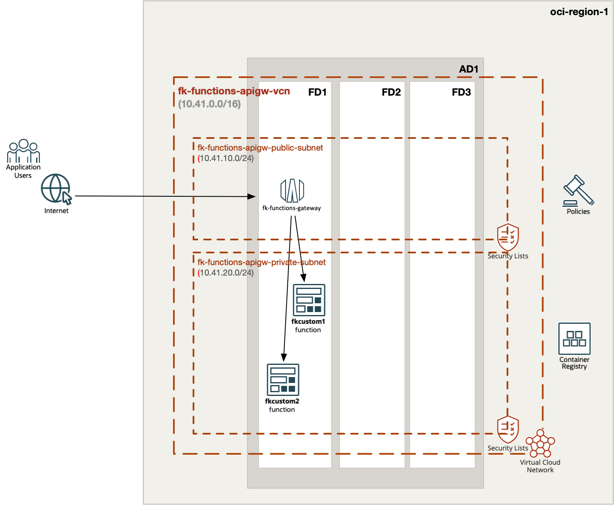
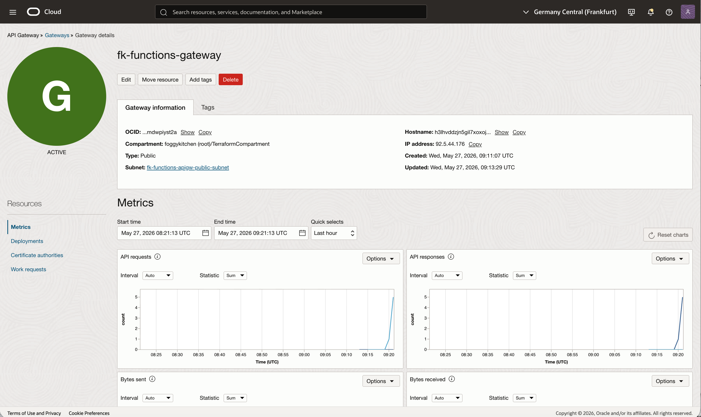
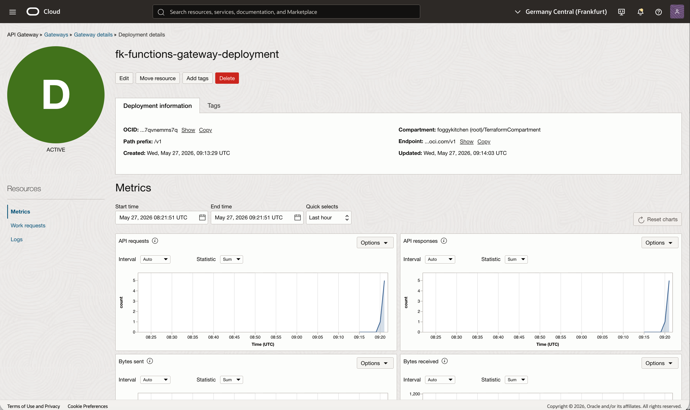
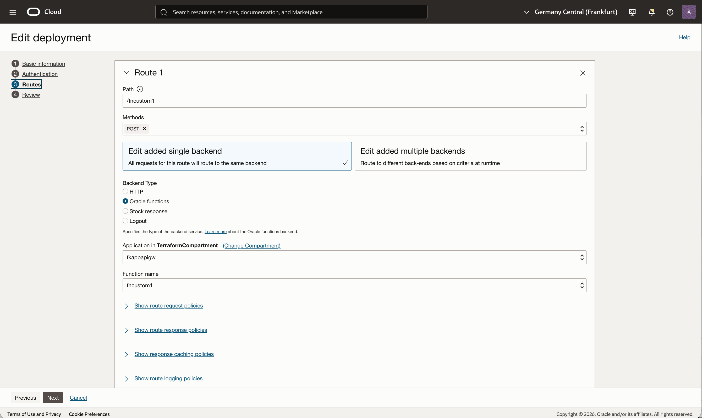
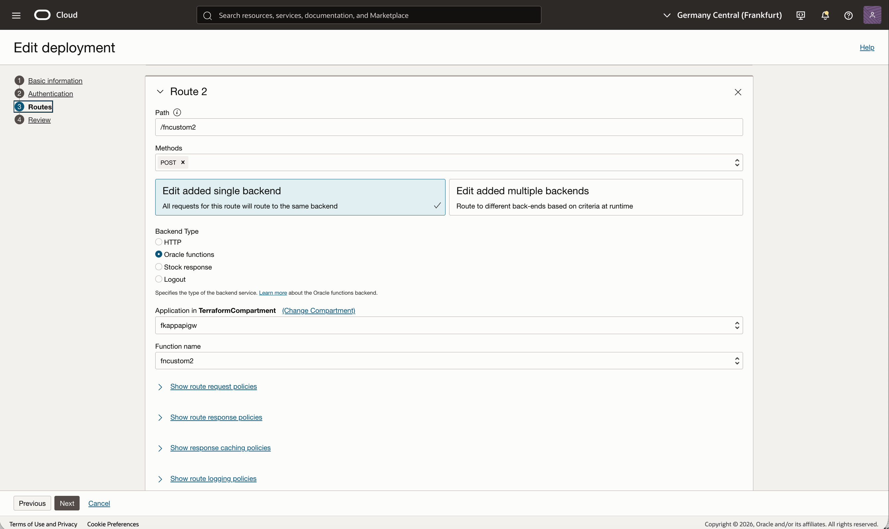
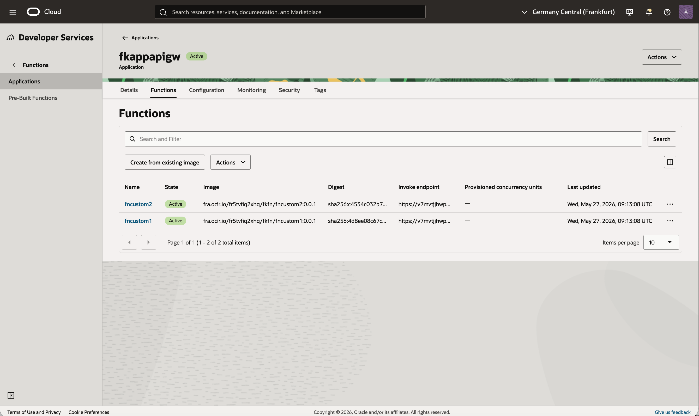
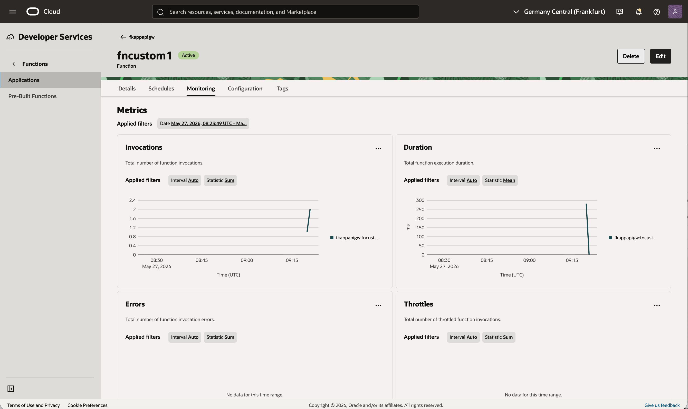
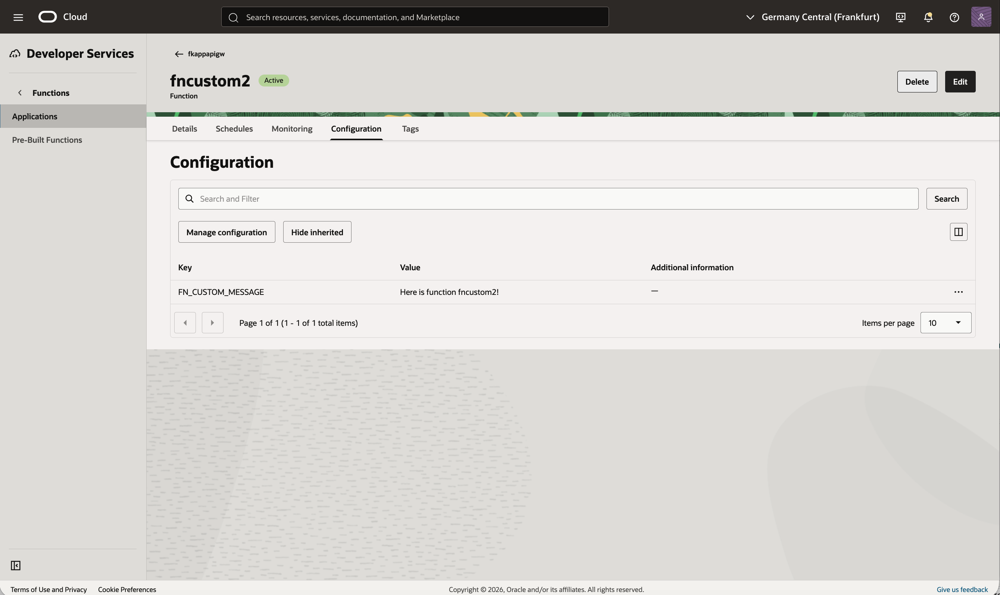
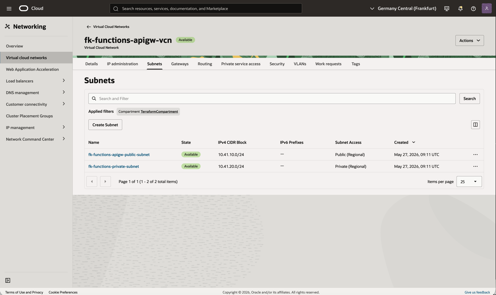

# Example 02: Functions Backend End-To-End Integration

This example shows a complete **OCI API Gateway -> OCI Functions** flow built from reusable FoggyKitchen modules.

The stack creates:
- `terraform-oci-fk-vcn` for networking
- `terraform-oci-fk-function` for two OCI Functions under one shared Functions Application
- `terraform-oci-fk-policy` for the API Gateway to Functions invocation policy
- `terraform-oci-fk-api-gateway` for public API publishing

This makes the example fully self-contained and avoids relying on pre-existing function OCIDs.

---

## Architecture Overview


Figure 1. High-level architecture for the example.

The API Gateway is exposed publicly and publishes two POST routes under the `/v1` path prefix. Both routes invoke OCI Functions that run inside one shared Functions Application attached to a private subnet.

The example also creates the explicit IAM policy needed for API Gateway to invoke the two functions. Function images are built locally and pushed to private OCIR repositories during `tofu apply`.

---

## What This Example Shows

- Public OCI API Gateway endpoint
- Private subnet placement for the shared OCI Functions application
- Two custom OCI Functions behind one shared API Gateway deployment
- Explicit IAM policy allowing API Gateway to invoke OCI Functions
- End-to-end reusable module composition across networking, serverless runtime, IAM, and API publishing

---

## Deploy Using Terraform CLI

```bash
cd examples/02_functions_backend
cp terraform.tfvars.example terraform.tfvars
tofu init
tofu plan
tofu apply
```

After apply, the example outputs:
- API Gateway deployment endpoint
- resolved route endpoints for `/v1/fncustom1` and `/v1/fncustom2`
- shared Functions application OCID
- function OCIDs

### Terminal Smoke Test

The first invocation may take a little longer. Right after `tofu apply`, OCI API Gateway and OCI Functions can still be settling, so the first request may briefly return a transient error such as `404 Not Found` or simply take longer than the steady-state response.

```bash
FNCUSTOM1_URL="$(tofu output -json route_endpoints | jq -r '.fncustom1')"
FNCUSTOM2_URL="$(tofu output -json route_endpoints | jq -r '.fncustom2')"

curl -s -X POST "$FNCUSTOM1_URL" | jq .
curl -s -X POST "$FNCUSTOM2_URL" | jq .
```

Possible early response:

```text
<html>
<head><title>404 Not Found</title></head>
<body>
<center><h1>404 Not Found</h1></center>
</body>
</html>
```

Expected healthy response:

```json
{"message":"Here is function fncustom1!"}
{"message":"Here is function fncustom2!"}
```

---

## OCI Console Verification

The screenshots below illustrate the expected result after a successful deployment and smoke test:


Figure 2. OCI API Gateway details for the public `fk-functions-gateway` endpoint.
This view confirms that the gateway is active, uses the public subnet, and exposes the public hostname that fronts both function routes.


Figure 3. OCI API Gateway deployment details for `fk-functions-gateway-deployment`.
The deployment shows the `/v1` path prefix and the metrics confirm that HTTP requests reached the deployed API surface.


Figure 4. OCI API Gateway route configuration for `/fncustom1`.
This route uses the Oracle Functions backend type and is wired to the `fncustom1` function in the shared `fkappapigw` application.


Figure 5. OCI API Gateway route configuration for `/fncustom2`.
This mirrors the previous route and confirms that the second POST path is routed to the `fncustom2` function in the same application.


Figure 6. Shared OCI Functions Application containing both deployed functions.
The application view confirms that `fncustom1` and `fncustom2` are active and run under one shared Functions Application created by the example.


Figure 7. Monitoring view for `fncustom1` after the API Gateway smoke test.
The invocation chart confirms that requests routed through API Gateway reached the first backend function and produced observable execution metrics.


Figure 8. Configuration view for `fncustom2` showing the injected `FN_CUSTOM_MESSAGE`.
This verifies that the example passed the expected function-specific configuration and that the second route returns its own message payload.


Figure 9. VCN subnet layout for the example networking stack.
The VCN view confirms the intended split between the public API Gateway subnet and the private Functions subnet used by the shared Functions Application.

---

## Notes

- This example builds and pushes two function images to OCIR.
- It requires valid `ocir_user_name` and `ocir_user_password` values.
- The first function creates the shared Functions Application.
- The second function joins that existing application.
- The Functions integration currently tracks the `update-2026` branch of `terraform-oci-fk-function`, because the 2025 `master` branch still depends on legacy `fn build` workflow behavior.

---

## Related Resources

- [Root module](../../README.md)
- [Examples index](../README.md)
- [FoggyKitchen OCI Function Module](https://github.com/foggykitchen/terraform-oci-fk-function)
- [FoggyKitchen OCI Policy Module](https://github.com/foggykitchen/terraform-oci-fk-policy)
- [FoggyKitchen OCI VCN Module](https://github.com/foggykitchen/terraform-oci-fk-vcn)

---

## License

Licensed under the **Universal Permissive License (UPL), Version 1.0**.
See [LICENSE](../../LICENSE) for details.

---

© 2026 [FoggyKitchen.com](https://foggykitchen.com) - Cloud. Code. Clarity.
